# 03 — Modelo Dimensional Definitivo

----------------------------------------------------
ESTADO: MODELO DIMENSIONAL DEFINITIVO — PENDIENTE DE GATE

Documento oficial del Modelo Dimensional del proyecto.  
Consolida decisiones aprobadas en Fase 1 y Subfases 2.1–2.2.1.  
No introduce hipótesis nuevas.  
Fuente de verdad para la Subfase 2.4 (Modelo Físico) tras Gate de Fase 2.
----------------------------------------------------

Fase: **2 — Diseño del Data Warehouse**  
Subfase: **2.3 — Modelo Dimensional Definitivo**  
Fecha: 2026-07-26

### Fuentes aprobadas

- `01_Proceso_Negocio.md`
- `02_Declaracion_Grano.md`
- `02A_Analisis_Claves.md`
- `02B_Bus_Matrix.md`
- `03A_Revision_Arquitectonica.md`
- `docs/analisis/01_Perfilado_Datos.md`, `02_Reglas_Negocio.md`, `03_Requisitos_Funcionales.md`
- Enunciado oficial (`Prueba_Tecnica.pdf`)

---

## 1. Introducción

### 1.1 Objetivo del modelo dimensional

Proveer una estructura analítica que permita al Director Comercial:

1. Medir **ventas válidas frente al presupuesto** por región, aliado, gerente, jefe y especialista (Reto 1).
2. Medir la **eficiencia de gestión TMK Outbound** por segmento, campaña y aliado (Reto 2).

El modelo separa tres procesos de negocio en tres hechos, conectados por dimensiones conformadas, respetando los granos y claves ya aprobados.

### 1.2 Justificación del uso de Star Schema

Se adopta **Star Schema** porque:

1. Existen **tres procesos** con granos distintos; cada uno se modela como un hecho central.
2. Las consultas ejecutivas (cumplimiento, rankings, contactabilidad) se benefician de hechos conectados a dimensiones **desnormalizadas** (pocos joins).
3. La Bus Matrix (`02B`) define dimensiones conformadas compartidas sin exigir jerarquías normalizadas en tablas separadas.
4. Power BI debe reflejar la estructura dimensional de la base; Star Schema es el patrón más directo y performante para ese consumo.
5. La revisión arquitectónica (`03A`) recomendó Star como opción preferida.

### 1.3 Razones para no utilizar Snowflake

No se adopta Snowflake Schema como diseño base porque:

1. La jerarquía comercial (gerente → jefe → especialista) puede representarse como **atributos desnormalizados** en una sola dimensión, suficiente para los KPIs del enunciado.
2. Snowflake aumentaría joins sin beneficio analítico obligatorio en la prueba.
3. Los catálogos entre fuentes no son 1:1; normalizar en múltiples tablas elevaría complejidad de ETL y de miembros “No informado”.
4. `03A` dejó Snowflake solo como alternativa a evaluar si el mantenimiento de jerarquía lo exigiera; **no hay evidencia aprobada que lo exija**.

---

## 2. Procesos de negocio

| Código | Proceso | Descripción | Fuente |
|--------|---------|-------------|--------|
| A | Venta comercial (cierre) | Evento transaccional de venta | `Ventas.xlsb` |
| B | Planeación y seguimiento de metas | Asignación de meta mensual | `Presupuesto.xlsb` |
| C | Gestión de registros TMK Outbound | Agregado tipificado de contactabilidad | `Registros.xlsb` |

Estos tres procesos están aprobados en `01_Proceso_Negocio.md`. No se fusionan en un único hecho.

---

## 3. Tablas de hechos

### 3.1 `fact_ventas`

| Campo | Contenido |
|-------|-----------|
| **Descripción** | Hecho de ventas comerciales (cierre) |
| **Proceso** | A — Venta comercial |
| **Grano aprobado** | 1 fila = 1 evento / registro transaccional de venta |
| **Business keys del origen** | **No existe clave natural.** `Código Factura` no es BK única (`02A`: 669 nulos; 1 446 códigos duplicados). |
| **Surrogate key del hecho** | `sk_venta` (obligatoria) |
| **Medidas** | `valor_antes_iva`; opcional `cuotas` |
| **Atributos degenerados** | `codigo_factura`; `flag_nota_credito`; indicadores de validez (factura presente ∧ sin nota crédito) |
| **KPIs soportados** | Ventas válidas vs presupuesto; desempeño por región/aliado/especialista/jefe (Reto 1) |
| **Dimensiones relacionadas** | Tiempo, Región, Canal, Categoría, Jerarquía comercial, Aliado, Marca, Vendedor, Validez de venta |
| **Justificación técnica** | Grano = fila fuente (`02`). Sin BK → SK. Filtro O1 para KPIs. No colapsar por factura. |

### 3.2 `fact_presupuesto`

| Campo | Contenido |
|-------|-----------|
| **Descripción** | Hecho de metas comerciales mensuales |
| **Proceso** | B — Planeación y seguimiento de metas |
| **Grano aprobado** | 1 fila = 1 asignación de meta mensual al cruce `MES + REGION + CANAL + CANAL2 + SUB CANAL + CATEGORIA + UNIDAD DE GESTION + ESPECIALISTA + JEFE + GERENTE + DESCRIP2` |
| **Business keys del origen** | Clave compuesta dimensional candidata (11 atributos); **no 100% única** (5 cruces con 2 montos distintos). Sin ID de presupuesto. |
| **Surrogate key del hecho** | `sk_presupuesto` (obligatoria) |
| **Medidas** | `terminales`, `tecnologia`, `tyt` (con `tyt = terminales + tecnologia` en el 100% de filas observadas) |
| **KPIs soportados** | Cumplimiento vs ventas; base para meta diaria / déficit (cálculo derivado con calendario hábil, **no** grano de este hecho) |
| **Dimensiones relacionadas** | Tiempo (mes), Región, Canal, Categoría, Unidad de gestión, Jerarquía comercial, Aliado |
| **Justificación técnica** | Grano mensual aprobado (`02`). Meta diaria es regla de negocio sobre Tiempo, no un cuarto proceso. |

### 3.3 `fact_gestion_tmk`

| Campo | Contenido |
|-------|-----------|
| **Descripción** | Hecho de gestión/contactabilidad TMK Outbound |
| **Proceso** | C — Gestión de registros TMK Outbound |
| **Grano aprobado** | 1 fila = 1 agregado tipificado de gestión (`cantidad` + `intentos`) |
| **Business keys del origen** | **No existe clave natural** (`02A`) |
| **Surrogate key del hecho** | `sk_gestion` (obligatoria) |
| **Medidas** | `cantidad`, `intentos` |
| **KPIs soportados** | Registros entregados; % gestión; % contactabilidad; % efectivos / no efectivos; rankings de aliados y campañas (Reto 2). Los % son **métricas derivadas** (fórmulas exactas: vacío del PDF). |
| **Dimensiones relacionadas** | Tiempo, Región, Canal*, Jerarquía comercial, Aliado, Campaña, Segmento, Tipo de contacto |
| **Justificación técnica** | ~80% filas con `CANTIDAD > 1` → no modelar contacto unitario. Alcance TMK Outbound = regla O8. |

\* Canal en Gestión: participación lógica por filtro de negocio TMK Outbound; la fuente no trae columna CANAL homónima (`02B`).

---

## 4. Dimensiones

Convención: toda dimensión tiene **surrogate key** (`sk_*`). Las “claves naturales” son descriptivas/de negocio cuando existen; ninguna reemplaza la SK salvo decisión física posterior documentada.

### 4.1 Conformadas

#### `dim_tiempo`

| Campo | Contenido |
|-------|-----------|
| Descripción | Calendario de análisis (día/mes/año) |
| Tipo | Conformada |
| Clave natural | Fecha / periodo (formatos heterogéneos en origen) |
| Surrogate key | `sk_tiempo` |
| Atributos | fecha, anio, mes, dia, periodo_yyyymm, es_dia_habil, es_festivo_co, nombre_mes, … |
| Hechos | `fact_ventas`, `fact_presupuesto`, `fact_gestion_tmk` |
| Justificación | Comparación temporal + reglas O2–O6 de meta diaria |

#### `dim_region`

| Campo | Contenido |
|-------|-----------|
| Descripción | División geográfica comercial |
| Tipo | Conformada |
| Clave natural | Texto de región (sin ID) |
| Surrogate key | `sk_region` |
| Atributos | codigo_region_nk, nombre_region, … |
| Hechos | Los tres |
| Justificación | KPIs por región; pendiente física: columna oficial en Ventas |

#### `dim_canal`

| Campo | Contenido |
|-------|-----------|
| Descripción | Canal / canal2 / subcanal (desnormalizado) |
| Tipo | Conformada |
| Clave natural | Combinación de textos de canal |
| Surrogate key | `sk_canal` |
| Atributos | canal, canal2, sub_canal |
| Hechos | Ventas, Presupuesto; Gestión vía filtro TMK |
| Justificación | Una sola dim Star evita fragmentar Canal (`02B`, `03A`) |

#### `dim_categoria`

| Campo | Contenido |
|-------|-----------|
| Descripción | Categoría comercial |
| Tipo | Conformada |
| Clave natural | Texto categoría |
| Surrogate key | `sk_categoria` |
| Atributos | categoria |
| Hechos | Ventas, Presupuesto |
| Justificación | Cruce común Reto 1 |

#### `dim_jerarquia_comercial`

| Campo | Contenido |
|-------|-----------|
| Descripción | Gerente → Jefe → Especialista (desnormalizado) |
| Tipo | Conformada |
| Clave natural | Textos de niveles (anonimizados) |
| Surrogate key | `sk_jerarquia` |
| Atributos | gerente, jefe, especialista |
| Hechos | Los tres |
| Justificación | KPIs Reto 1; Star desnormalizado (no Snowflake) |

#### `dim_aliado`

| Campo | Contenido |
|-------|-----------|
| Descripción | Socio operativo |
| Tipo | Conformada |
| Clave natural | Texto aliado |
| Surrogate key | `sk_aliado` |
| Atributos | aliado_nk, nombre_aliado |
| Hechos | Los tres |
| Justificación | Actor central Retos 1 y 2; homologar `DESCRIP2` / `GV_Desc2` / `ALIADO` |

### 4.2 Exclusivas

#### `dim_unidad_gestion`

| Campo | Contenido |
|-------|-----------|
| Descripción | Unidad de gestión del presupuesto |
| Tipo | Exclusiva (Presupuesto) |
| Clave natural | Texto |
| Surrogate key | `sk_unidad_gestion` |
| Atributos | unidad_gestion |
| Hechos | `fact_presupuesto` |
| Justificación | Parte del grano aprobado de Presupuesto |

#### `dim_marca`

| Campo | Contenido |
|-------|-----------|
| Descripción | Marca del equipo/producto |
| Tipo | Exclusiva (Venta) |
| Clave natural | Texto |
| Surrogate key | `sk_marca` |
| Atributos | marca |
| Hechos | `fact_ventas` |
| Justificación | Solo en Ventas |

#### `dim_vendedor`

| Campo | Contenido |
|-------|-----------|
| Descripción | Ejecutor de la venta |
| Tipo | Exclusiva (Venta) |
| Clave natural | Cédula (PII; valor `-` posible) |
| Surrogate key | `sk_vendedor` |
| Atributos | cedula_vendedor_nk, … |
| Hechos | `fact_ventas` |
| Justificación | Atributo de venta; política PII → Modelo Físico / publicación |

#### `dim_validez_venta` *(o atributos degenerados en el hecho)*

| Campo | Contenido |
|-------|-----------|
| Descripción | Criterio de venta válida (factura presente ∧ sin nota crédito) |
| Tipo | Exclusiva (Venta) |
| Clave natural | Flags / código factura (no PK del evento) |
| Surrogate key | `sk_validez` si se materializa como dim |
| Atributos | tiene_factura, tiene_nota_credito, es_venta_valida |
| Hechos | `fact_ventas` |
| Justificación | Regla oficial O1 / Reto 1 |

#### `dim_campana`

| Campo | Contenido |
|-------|-----------|
| Descripción | Campaña TMK |
| Tipo | Exclusiva (Gestión) |
| Clave natural | `NOMBRE_CAMPAÑA` |
| Surrogate key | `sk_campana` |
| Atributos | nombre_campana |
| Hechos | `fact_gestion_tmk` |
| Justificación | KPIs Reto 2 |

#### `dim_segmento`

| Campo | Contenido |
|-------|-----------|
| Descripción | Segmento de gestión |
| Tipo | Exclusiva (Gestión) |
| Clave natural | Texto (requiere normalización) |
| Surrogate key | `sk_segmento` |
| Atributos | segmento, segmento_normalizado |
| Hechos | `fact_gestion_tmk` |
| Justificación | Análisis por segmento; limpieza en ETL (Fase 4) |

#### `dim_tipo_contacto`

| Campo | Contenido |
|-------|-----------|
| Descripción | Tipificación de contacto |
| Tipo | Exclusiva (Gestión) |
| Clave natural | `TIPO_CONTACTO` + `DETALLE1` |
| Surrogate key | `sk_tipo_contacto` |
| Atributos | tipo_contacto, detalle_contacto |
| Hechos | `fact_gestion_tmk` |
| Justificación | Base de % efectivos / no efectivos |

---

## 5. Bus Matrix (integrada)

Fuente: `02B_Bus_Matrix.md` (aprobada). Sin cambios de sentido.

| Dimensión \ Proceso | Venta | Presupuesto | Gestión TMK | Tipo |
|---------------------|:-----:|:-----------:|:-----------:|------|
| Tiempo | X | X | X | Conformada |
| Región | X | X | X | Conformada |
| Canal | X | X | X* | Conformada |
| Categoría | X | X | — | Conformada |
| Unidad de gestión | — | X | — | Exclusiva |
| Jerarquía comercial | X | X | X | Conformada |
| Aliado | X | X | X | Conformada |
| Marca | X | — | — | Exclusiva |
| Vendedor | X | — | — | Exclusiva |
| Validez de venta | X | — | — | Exclusiva |
| Campaña | — | — | X | Exclusiva |
| Segmento | — | — | X | Exclusiva |
| Tipo de contacto | — | — | X | Exclusiva |

\* Filtro de negocio TMK Outbound.

---

## 6. Diagrama del Modelo Dimensional

```mermaid
erDiagram
    dim_tiempo ||--o{ fact_ventas : "sk_tiempo"
    dim_region ||--o{ fact_ventas : "sk_region"
    dim_canal ||--o{ fact_ventas : "sk_canal"
    dim_categoria ||--o{ fact_ventas : "sk_categoria"
    dim_jerarquia_comercial ||--o{ fact_ventas : "sk_jerarquia"
    dim_aliado ||--o{ fact_ventas : "sk_aliado"
    dim_marca ||--o{ fact_ventas : "sk_marca"
    dim_vendedor ||--o{ fact_ventas : "sk_vendedor"
    dim_validez_venta ||--o{ fact_ventas : "sk_validez"

    dim_tiempo ||--o{ fact_presupuesto : "sk_tiempo"
    dim_region ||--o{ fact_presupuesto : "sk_region"
    dim_canal ||--o{ fact_presupuesto : "sk_canal"
    dim_categoria ||--o{ fact_presupuesto : "sk_categoria"
    dim_unidad_gestion ||--o{ fact_presupuesto : "sk_unidad_gestion"
    dim_jerarquia_comercial ||--o{ fact_presupuesto : "sk_jerarquia"
    dim_aliado ||--o{ fact_presupuesto : "sk_aliado"

    dim_tiempo ||--o{ fact_gestion_tmk : "sk_tiempo"
    dim_region ||--o{ fact_gestion_tmk : "sk_region"
    dim_jerarquia_comercial ||--o{ fact_gestion_tmk : "sk_jerarquia"
    dim_aliado ||--o{ fact_gestion_tmk : "sk_aliado"
    dim_campana ||--o{ fact_gestion_tmk : "sk_campana"
    dim_segmento ||--o{ fact_gestion_tmk : "sk_segmento"
    dim_tipo_contacto ||--o{ fact_gestion_tmk : "sk_tipo_contacto"

    fact_ventas {
        int sk_venta PK
        int sk_tiempo FK
        int sk_region FK
        int sk_canal FK
        int sk_categoria FK
        int sk_jerarquia FK
        int sk_aliado FK
        int sk_marca FK
        int sk_vendedor FK
        int sk_validez FK
        string codigo_factura
        decimal valor_antes_iva
        decimal cuotas
    }

    fact_presupuesto {
        int sk_presupuesto PK
        int sk_tiempo FK
        int sk_region FK
        int sk_canal FK
        int sk_categoria FK
        int sk_unidad_gestion FK
        int sk_jerarquia FK
        int sk_aliado FK
        decimal terminales
        decimal tecnologia
        decimal tyt
    }

    fact_gestion_tmk {
        int sk_gestion PK
        int sk_tiempo FK
        int sk_region FK
        int sk_jerarquia FK
        int sk_aliado FK
        int sk_campana FK
        int sk_segmento FK
        int sk_tipo_contacto FK
        int cantidad
        decimal intentos
    }
```

---

## 7. Riesgos de diseño

| ID | Riesgo | Mitigación (ya definida) |
|----|--------|--------------------------|
| R1 | Usar `Código Factura` como PK | Prohibido; SK + atributo degenerado |
| R2 | Colapsar Gestión a 1 contacto/fila | Grano agregado obligatorio |
| R3 | Mezclar procesos en un solo hecho | Tres hechos / Bus Matrix |
| R4 | Meta diaria como grano de Presupuesto | Cálculo sobre `dim_tiempo` |
| R5 | Catálogos no 1:1 entre fuentes | Dims conformadas + miembro “No informado” |
| R6 | 5 cruces Presupuesto con montos distintos | Regla de carga en Modelo Físico / ETL |
| R7 | Columna región ambigua en Ventas | Decisión de mapeo en Modelo Físico |
| R8 | Fórmulas % Reto 2 no definidas en PDF | Formalizar en físico/ETL/DAX sin contradecir enunciado |
| R9 | PII (vendedor/cliente) | Política en publicación / físico |

---

## 8. Decisiones arquitectónicas adoptadas

| ID | Decisión | Origen |
|----|----------|--------|
| D1 | Star Schema (no Snowflake como base) | `03A`, `02B`, enunciado |
| D2 | Tres hechos = tres procesos | `01`, `02B` |
| D3 | Granos literales de `02_Declaracion_Grano` | Aprobado |
| D4 | Surrogate keys obligatorias en hechos y dimensiones | `02A`, `03A` |
| D5 | `Código Factura` no es clave natural | `02A` |
| D6 | Dimensiones conformadas según Bus Matrix | `02B` |
| D7 | Jerarquía comercial desnormalizada en una dim | `03A` / anti-Snowflake |
| D8 | Canal como una dim desnormalizada | `02B` |
| D9 | Ventas válidas = factura ∧ ¬nota crédito | Reglas O1 / enunciado |
| D10 | Meta diaria / déficit = reglas sobre Tiempo, no grano de Presupuesto | Enunciado + `01` |

---

## 9. Pendientes que pasan al Modelo Físico (Subfase 2.4)

1. Tipos de datos, constraints, índices y naming físico en PostgreSQL.  
2. Regla de carga de los **5 cruces** de Presupuesto (¿sumar?).  
3. Mapeo de la **columna oficial de región** en Ventas.  
4. Calendario de **festivos Colombia** (fuente de datos).  
5. Normalización de `SEGMENTO` y miembros huérfanos de región.  
6. Política de **PII** (vendedor/cliente) para repo/publicación.  
7. Definición operativa de fórmulas **% Gestión / Contactabilidad / Efectivos**.  
8. SCD (si aplica) y estrategia full vs incremental.  
9. Vistas de consumo para Power BI.  
10. Decisión final: `dim_validez_venta` vs flags degenerados en `fact_ventas`.

Estos pendientes **no alteran** procesos, granos ni Bus Matrix.

---

## 10. Conclusión

Este documento consolida el **Modelo Dimensional Definitivo** del proyecto a partir de decisiones ya aprobadas:

- 3 procesos → 3 hechos (`fact_ventas`, `fact_presupuesto`, `fact_gestion_tmk`).  
- Star Schema con dimensiones conformadas y exclusivas según Bus Matrix.  
- Surrogate keys obligatorias; sin usar `Código Factura` como identidad del evento.  
- Granos fijados y trazables a evidencia.

### Estado para el Gate

El documento **ya puede considerarse la versión oficial de diseño dimensional** del repositorio, sujeta a:

1. Revisión formal del Tech Lead / Project Owner (Gate Subfase 2.3 / Fase 2).  
2. Resolución de pendientes **solo** en el Modelo Físico, sin reabrir granos ni procesos.

**No se inicia** aún DDL, PostgreSQL, ETL, Airflow ni Power BI hasta el Gate correspondiente.
